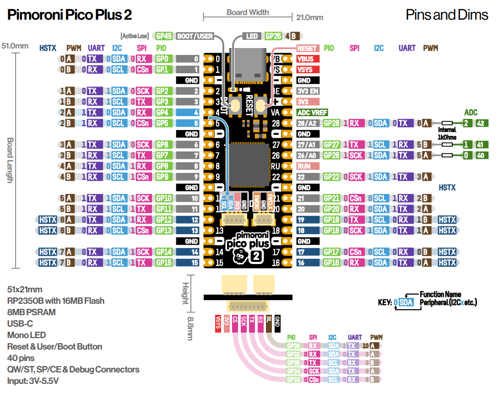

# Experiments with the RP2350 MCU

### Pimoroni Pico Plus 2

* [code\PimoroniPico2Plus_picoSDK](https://github.com/tomfleet/RP2350/tree/main/code/PimoroniPico2Plus_picoSDK)

---

## SeeedStudio Xiao RP2350

- [https://wiki.seeedstudio.com/getting-started-xiao-rp2350/](https://https://wiki.seeedstudio.com/getting-started-xiao-rp2350/)
-

---

## SolderParty RP2350 Stamp XL

- [https://www.solder.party/docs/rp2350-stamp-xl/](https://https://www.solder.party/docs/rp2350-stamp-xl/)

